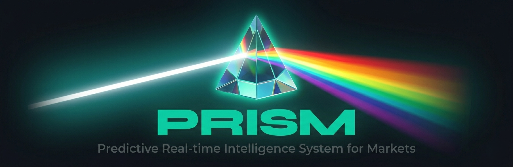
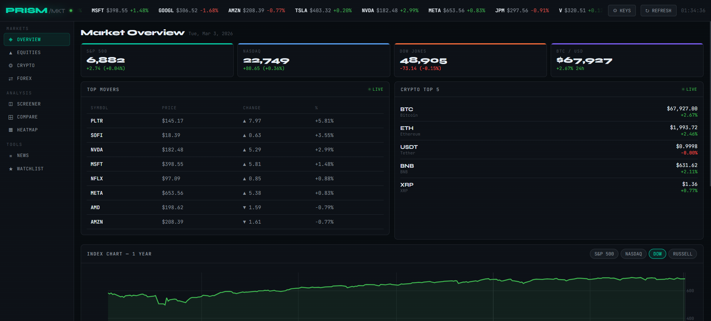
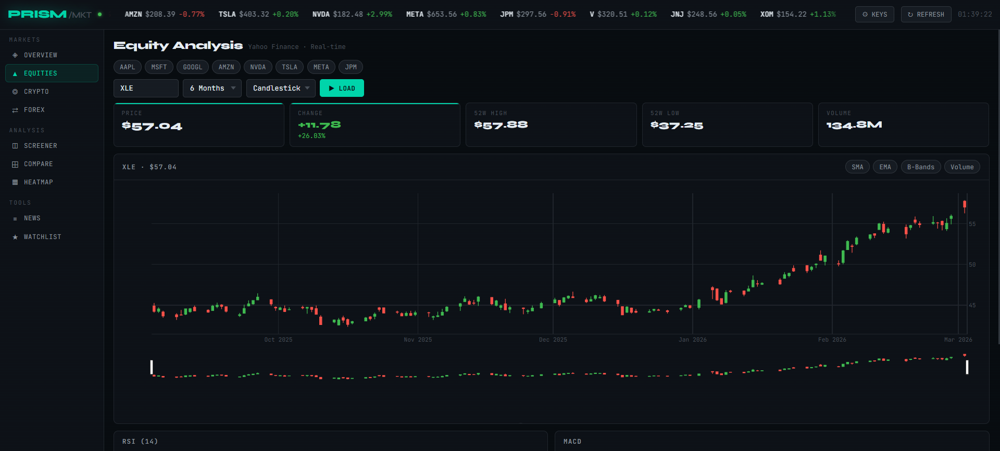
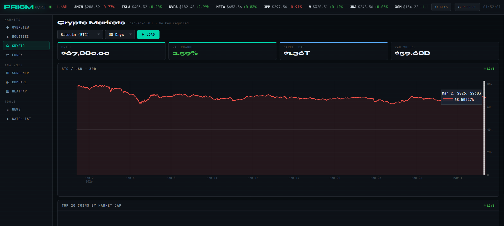
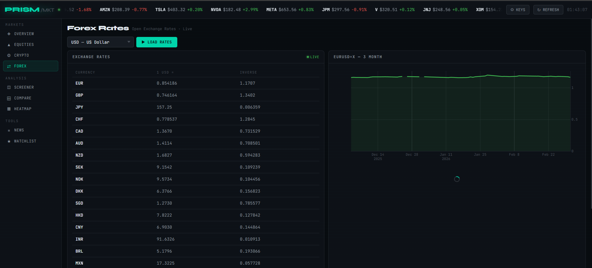
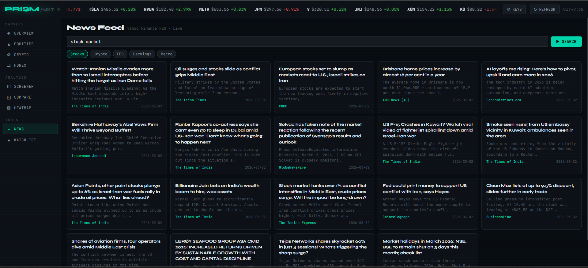
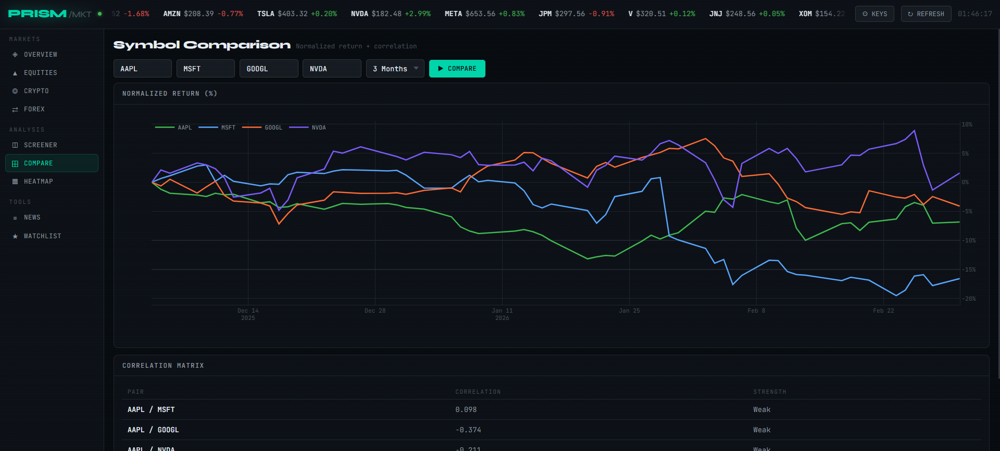
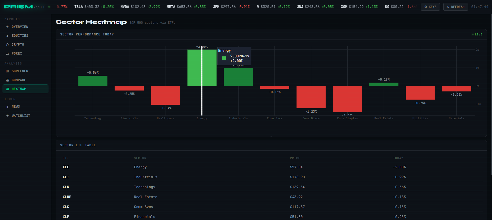

# 📈 PRISM — Market Intelligence Terminal




<p align="center">
  
  
  
  
</p>

---

## Overview

PRISM is a **real-time market intelligence terminal** built with **HTML, CSS, and JavaScript**, featuring **Plotly.js** for interactive visualizations. It aggregates data from **5+ financial APIs** to provide a comprehensive view of global markets.

## ✨ Key Features

### 📊 **8 Interactive Panels**

| Panel                     | Focus                | Description                                              |
| ------------------------- | -------------------- | -------------------------------------------------------- |
| **01 — Overview**  | Market Summary       | Real-time indices, top movers, crypto mini, index charts |
| **02 — Equities**  | Stock Analysis       | Candlestick/OHLC charts, technical indicators, RSI, MACD |
| **03 — Crypto**    | Cryptocurrency       | Live prices, market cap, volume, 20-coin table           |
| **04 — Forex**     | Currency Markets     | Live exchange rates, 30-day trend charts                 |
| **05 — Screener**  | Multi-stock Analysis | Batch screening, RSI-based signals, buy/sell/hold tags   |
| **06 — News Feed** | Market News          | Financial headlines from multiple sources                |
| **07 — Compare**   | Symbol Comparison    | Normalized returns, correlation matrix                   |
| **08 — Heatmap**   | Sector Performance   | S&P 500 sector ETFs, performance visualization           |

---

## 📈 **Module 01: Market Overview**

### **Live Market KPIs** 📊

| Index               | Provider      | Format             | Update    |
| ------------------- | ------------- | ------------------ | --------- |
| **S&P 500**   | Yahoo Finance | Price + Change %   | Real-time |
| **NASDAQ**    | Yahoo Finance | Price + Change %   | Real-time |
| **DOW JONES** | Yahoo Finance | Price + Change %   | Real-time |
| **BTC/USD**   | CoinGecko     | Price + 24h Change | Live      |

### **Real-time Components** ⚡

- **Top Movers** — 8 most volatile stocks with price and % change
- **Crypto Mini** — Top 5 cryptocurrencies by market cap
- **Index Chart** — 1-year performance with interactive hover
- **Most Active** — Volume leaders with live data
- **Ticker Tape** — Scrolling prices for 15 major stocks




---

## 📉 **Module 02: Equities Analysis**

### **Interactive Chart Controls** 🎮

- **Symbol input** — Any valid Yahoo Finance ticker
- **Time ranges**: 5D, 1M, 3M, 6M, 1Y, 2Y, 5Y
- **Chart types**: Candlestick, Line, OHLC
- **Technical indicators toggle**:
  - 🔵 **SMA** (20, 50) — Simple Moving Average
  - 🟣 **EMA** (12) — Exponential Moving Average
  - 🔷 **Bollinger Bands** (20, 2σ)
  - 🟢 **Volume** bars with color by price direction

### **Technical Indicators** 📐

| Indicator                 | Parameters                   | Display                           |
| ------------------------- | ---------------------------- | --------------------------------- |
| **RSI (14)**        | Overbought >70, Oversold <30 | Line chart with bands             |
| **MACD**            | 12, 26, 9                    | MACD line, Signal line, Histogram |
| **SMA**             | 20, 50                       | Moving averages overlay           |
| **EMA**             | 12                           | Exponential average overlay       |
| **Bollinger Bands** | 20, 2σ                      | Upper/lower bands, middle line    |

### **Real-time KPIs** 📊

- Current Price
- Change ($ and %)
- 52-Week High/Low
- Volume



---

## 🪙 **Module 03: Cryptocurrency Markets**

### **Live Data Sources** 🔗

- **Provider**: CoinGecko API (no key required)
- **Update frequency**: Real-time with rate limiting

### **Features** ✨

- **Top 20 coins** by market cap with 1h, 24h, 7d changes
- **Price charts** for any coin (30+ options)
- **Time ranges**: 24h, 7d, 30d, 90d, 1y
- **Market metrics**: Price, 24h change, Market Cap, Volume
- **Coin icons** with circular images

### **Supported Coins** 🪙

| Coin         | Symbol | API ID          |
| ------------ | ------ | --------------- |
| Bitcoin      | BTC    | `bitcoin`     |
| Ethereum     | ETH    | `ethereum`    |
| Binance Coin | BNB    | `binancecoin` |
| Solana       | SOL    | `solana`      |
| XRP          | XRP    | `ripple`      |
| Cardano      | ADA    | `cardano`     |
| Avalanche    | AVAX   | `avalanche-2` |
| Dogecoin     | DOGE   | `dogecoin`    |
| Polkadot     | DOT    | `polkadot`    |
| Chainlink    | LINK   | `chainlink`   |




---

## 💱 **Module 04: Forex Markets**

### **Live Exchange Rates** 💵

- **Provider**: Open Exchange Rates (free tier)
- **Base currency**: USD, EUR, GBP, JPY, CHF selectable
- **20+ currencies** displayed with rates and inverse rates

### **Forex Chart** 📈

- **Pair**: `EURUSD=X` or `${base}USD=X` via Yahoo Finance
- **Time range**: 3 months daily data
- **Interactive line chart** with fill

### **Currencies Tracked** 💶

USD, EUR, GBP, JPY, CHF, CAD, AUD, NZD, SEK, NOK, DKK, SGD, HKD, CNY, INR, BRL, MXN, KRW, ZAR, TRY



---

## 🔍 **Module 05: Market Screener**

### **Batch Analysis** 🔬

- **Input**: Comma-separated tickers (up to 15)
- **Pre-set sectors**: Technology, Finance, Healthcare, Energy
- **Real-time screening** with progress indicator

### **Analysis Per Symbol** 📊

- Current Price
- Change ($ and %)
- RSI (14) value
- Price vs SMA 20/50 comparison
- Volume
- **Trading signal** (BUY/SELL/HOLD)

### **Signal Logic** 🚦

| Signal         | Condition                                       |
| -------------- | ----------------------------------------------- |
| **BUY**  | RSI < 30 OR (Price above SMA 20 AND gain > 1%)  |
| **SELL** | RSI > 70 OR (Price below SMA 20 AND loss < -1%) |
| **HOLD** | Default state                                   |

### **Results Table** 📋

- Sortable by % change (descending)
- Color-coded RSI values
- Signal tags with appropriate styling
  


---

## 📰 **Module 06: News Feed**

### **Multi-source Fallback** 📡

1. **NewsAPI** — Requires free API key (configurable)
2. **Yahoo Finance RSS** — Via CORS proxy
3. **GNews API** — Free tier fallback

### **Search Features** 🔎

- **Query input** — Search by topic/keyword
- **Preset queries**: Stocks, Crypto, Fed, Earnings, Macro
- **Live headlines** with source and time

### **News Card Design** 🃏

- Title with hover effect
- Description preview
- Source name (accent color)
- Publication date
- Click to open full article



---

## 📊 **Module 07: Symbol Comparison**

### **Comparison Features** 🔄

- **Up to 4 symbols** simultaneous comparison
- **Time ranges**: 1M, 3M, 6M, 1Y
- **Normalized returns** (%) — all series start at 100%

### **Correlation Matrix** 📐

- Pairwise Pearson correlation
- Strength categories:
  - 🟢 **STRONG** (>0.7)
  - 🟡 **MODERATE** (0.4–0.7)
  - 🔴 **WEAK** (<0.4)

### **Color-coded symbols** 🎨

- Symbol 1: `#3fb950` (green)
- Symbol 2: `#58a6ff` (blue)
- Symbol 3: `#ff6b35` (orange)
- Symbol 4: `#7c5cfc` (purple)



---

## 🔥 **Module 08: Sector Heatmap**

### **Sector ETFs Tracked** 📊

| ETF            | Sector           | Focus                               |
| -------------- | ---------------- | ----------------------------------- |
| **XLK**  | Technology       | Software, hardware, semiconductors  |
| **XLF**  | Financials       | Banks, insurance, investment firms  |
| **XLV**  | Healthcare       | Pharmaceuticals, biotech, equipment |
| **XLE**  | Energy           | Oil, gas, equipment, services       |
| **XLI**  | Industrials      | Aerospace, defense, transportation  |
| **XLC**  | Comm Services    | Media, telecom, entertainment       |
| **XLY**  | Consumer Disc.   | Retail, auto, consumer services     |
| **XLP**  | Consumer Staples | Food, beverage, household goods     |
| **XLRE** | Real Estate      | REITs, real estate services         |
| **XLU**  | Utilities        | Electric, gas, water utilities      |
| **XLB**  | Materials        | Chemicals, mining, forestry         |

### **Heatmap Visualization** 🎨

- **Bar chart** with today's performance
- **Color gradient** by performance:
  - 🟢 Strong gain (>2%)
  - 🟢 Moderate gain (0.5–2%)
  - 🟢 Slight gain (0–0.5%)
  - 🔴 Slight loss (0– -0.5%)
  - 🔴 Moderate loss (-0.5– -2%)
  - 🔴 Strong loss (< -2%)

### **Sector Table** 📋

- Sortable by performance
- ETF symbol, sector name, price, daily change
- Click any row to load stock chart



---

## 🎨 **Design & Aesthetics**

### **Terminal-Inspired Interface** 🖥️

- **Dark background** (`#080c10`) — professional trading terminal aesthetic
- **Green accent** (`#00d4aa`) for positive indicators
- **Red** (`#f85149`) for negative indicators
- **Blue** (`#58a6ff`) for technical indicators
- **Orange** (`#ff6b35`) for accent elements
- **Monospace fonts** — JetBrains Mono, Space Mono for data tables

### **Typography** ✍️

- **Syne** — Bold headers, KPI values, logo
- **JetBrains Mono** — Code blocks, technical data, tables
- **Space Mono** — Body text, descriptions

### **Visual Elements** 🖼️

- **Ticker tape** with scrolling stock prices
- **Glass-morphism cards** with subtle borders
- **Color-coded KPI cards** with accent lines
- **Toast notifications** for user feedback
- **Loading spinners** during data fetches
- **Chip buttons** for quick selections

### **Color Coding** 🎨

| Element            | Color  | Hex         | Usage                |
| ------------------ | ------ | ----------- | -------------------- |
| **Positive** | Green  | `#3fb950` | Gains, BUY signals   |
| **Negative** | Red    | `#f85149` | Losses, SELL signals |
| **Neutral**  | Yellow | `#d29922` | HOLD signals         |
| **Blue**     | Blue   | `#58a6ff` | SMA, indicators      |
| **Orange**   | Orange | `#ff6b35` | Accent elements      |
| **Purple**   | Purple | `#7c5cfc` | EMA, correlations    |
| **Accent**   | Teal   | `#00d4aa` | Primary brand color  |

---

## 🛠️ **Technical Implementation**

### **Architecture**

```
┌─────────────────────────────────────┐
│      PRISM Market Terminal           │
├─────────────────────────────────────┤
│                                     │
│  ┌─────────────────────────────┐   │
│  │   API Integration Layer      │   │
│  │   • Yahoo Finance           │   │
│  │   • CoinGecko               │   │
│  │   • Open Exchange Rates     │   │
│  │   • NewsAPI                 │   │
│  │   • GNews                   │   │
│  │   • Yahoo RSS               │   │
│  └─────────────────────────────┘   │
│                                     │
│  ┌─────────────────────────────┐   │
│  │   Panel Management          │   │
│  │   • 8 panels               │   │
│  │   • Lazy loading           │   │
│  │   • State persistence      │   │
│  └─────────────────────────────┘   │
│                                     │
│  ┌─────────────────────────────┐   │
│  │   Chart Engine (Plotly)     │   │
│  │   • 15+ chart types        │   │
│  │   • Technical overlays     │   │
│  │   • Real-time updates      │   │
│  └─────────────────────────────┘   │
│                                     │
│  ┌─────────────────────────────┐   │
│  │   Technical Indicators      │   │
│  │   • SMA / EMA               │   │
│  │   • RSI / MACD             │   │
│  │   • Bollinger Bands        │   │
│  │   • Pearson correlation    │   │
│  └─────────────────────────────┘   │
│                                     │
│  ┌─────────────────────────────┐   │
│  │   Watchlist & Storage       │   │
│  │   • localStorage           │   │
│  │   • Add/remove symbols     │   │
│  │   • Real-time updates      │   │
│  └─────────────────────────────┘   │
└─────────────────────────────────────┘
```

### **Key Functions**

```javascript
// API Integration
fetchYahooChart(symbol, range, interval)   // Stock/crypto data from Yahoo
fetchCoinGecko(path)                        // Crypto data from CoinGecko
loadForex()                                  // Forex rates from Open Exchange

// Chart Management
renderStockChart({ sym, data, range })       // Main stock chart with indicators
renderRSI(data)                               // RSI subplot
renderMACD(data)                               // MACD subplot

// Technical Indicators
calcSMA(arr, n)                                // Simple Moving Average
calcEMA(arr, n)                                 // Exponential Moving Average
calcRSI(arr, n)                                 // Relative Strength Index
calcMACD(arr)                                   // MACD line, signal, histogram
calcBB(arr, n, k)                               // Bollinger Bands
pearsonCorr(a, b)                               // Pearson correlation

// Panel Management
showPanel(id)                                    // Switch between panels
loadStock()                                      // Load equity chart
loadCrypto()                                     // Load crypto chart
runScreener()                                     // Batch stock screening
runComparison()                                   // Multi-symbol comparison

// Watchlist
addToWatchlist()                                 // Add symbol to watchlist
refreshWatchlist()                                // Update watchlist prices
removeWatch(sym)                                  // Remove from watchlist

// Utilities
toast(msg, type)                                  // Toast notification
fmtNum(n, dec)                                    // Number formatting
fmtPct(n)                                          // Percentage formatting
fmtVol(n)                                          // Volume formatting
```

---

## 📊 **Technical Indicators Implementation**

| Indicator                 | Formula                                 | Parameters                    |
| ------------------------- | --------------------------------------- | ----------------------------- |
| **SMA**             | (x₁ + x₂ + ... + xₙ) / n             | 20, 50 periods                |
| **EMA**             | EMAₜ = α × Pₜ + (1-α) × EMAₜ₋₁ | α = 2/(n+1)                  |
| **RSI**             | RSI = 100 - 100/(1 + RS)                | RS = avg gain / avg loss (14) |
| **MACD**            | MACD = EMA₁₂ - EMA₂₆                | Signal = EMA₉ of MACD        |
| **Bollinger Bands** | Upper = SMA + kσ, Lower = SMA - kσ    | k=2, 20 periods               |

---

## 📊 **API Integration Details**

| API                           | Endpoint                                      | Data                       | Rate Limit           |
| ----------------------------- | --------------------------------------------- | -------------------------- | -------------------- |
| **Yahoo Finance**       | `query1.finance.yahoo.com/v8/finance/chart` | Stocks, indices, forex     | None (public)        |
| **CoinGecko**           | `api.coingecko.com/api/v3`                  | Crypto prices, market data | 50 calls/min         |
| **Open Exchange Rates** | `open.er-api.com/v6/latest`                 | Forex rates                | 1000 calls/month     |
| **NewsAPI**             | `newsapi.org/v2/everything`                 | News headlines             | 100 calls/day (free) |
| **GNews**               | `gnews.io/api/v4/search`                    | News fallback              | 100 calls/day        |

---

## 🎥 **Video Demo Script** (60-75 seconds)

| Time | Panel     | Scene        | Action                                             |
| ---- | --------- | ------------ | -------------------------------------------------- |
| 0:00 | Header    | Logo         | Show PRISM logo with ticker tape                   |
| 0:05 | Overview  | KPIs         | Show S&P 500 +2.3%, NASDAQ +1.8%                   |
| 0:10 | Overview  | Top Movers   | Click on NVDA row                                  |
| 0:15 | Equities  | Chart        | Load NVDA candlestick chart with SMA/EMA           |
| 0:20 | Equities  | Indicators   | Toggle Bollinger Bands → chart updates            |
| 0:25 | Crypto    | Chart        | Switch to Bitcoin, 30-day chart                    |
| 0:30 | Crypto    | Table        | Show top 20 coins with 24h changes                 |
| 0:35 | Screener  | Tech         | Screen 8 tech stocks → BUY/SELL signals           |
| 0:40 | Compare   | Multi-symbol | Compare AAPL/MSFT/GOOGL/NVDA → correlation matrix |
| 0:45 | Heatmap   | Sector       | Show XLK +1.2%, XLE -0.8%                          |
| 0:50 | Watchlist | Add          | Add symbol to watchlist → live price              |
| 0:55 | News      | Search       | Load financial headlines                           |
| 1:00 | Close     | Toast        | Success notification                               |

---

## 🚦 **Performance**

- **Load Time**: < 2.5 seconds (cached after first load)
- **Memory Usage**: < 60 MB
- **CPU Usage**: Moderate during chart rendering
- **Network**: Real-time API calls on demand

### **Dependencies** 📦

- **Plotly.js** — v2.27.0 (CDN)
- **No CSS frameworks** — Pure CSS

---

## 🛡️ **Security Notes**

PRISM is a **client-side only** application:

- ✅ No backend server
- ✅ API keys stored only in browser localStorage
- ✅ CORS proxy used for Yahoo Finance (public endpoint)
- ✅ No tracking or analytics
- ✅ All calculations performed client-side

---

## 📝 **License**

MIT License — see LICENSE file for details.

---

## 🙏 **Acknowledgments**

- **Yahoo Finance** — Public chart API
- **CoinGecko** — Free cryptocurrency data
- **Open Exchange Rates** — Free forex tier
- **NewsAPI** — Headlines service
- **GNews** — Fallback news API
- **Plotly** — Interactive charting library

---

## 📧 **Contact**

- **GitHub Issues**: [Create an issue](https://github.com/Willie-Conway/PRISM/issues)
- **Website**: https://willie-conway.github.io/PRISM/

---

## 🏁 **Future Enhancements**

- [ ] Add portfolio tracking
- [ ] Options chain data
- [ ] Economic calendar
- [ ] Earnings calendar
- [ ] Insider trading data
- [ ] Backtesting simulator
- [ ] Paper trading
- [ ] Real-time WebSocket streams
- [ ] Mobile app version
- [ ] Dark/light theme toggle
- [ ] Export charts as images
- [ ] Multi-language support

---

<p align="center">
  <strong>📈 PRISM — Professional Market Intelligence Terminal 📈</strong>
</p>


---

*Last updated: March 2026*
